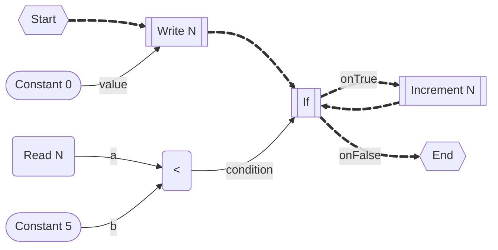

# High Level Intermediate Representation

The high level intermediate representation is used as an intermediate step between reading the IL of node implementations and writing the compiled/transpiled resulting IL.

## Basic Example


```cs
local int X = 0;
state start {
  next b_write;
}
state b_write {
  int value;
  // Eval inputs
  call b_const(&value);
  // Write (value, &X);
  X = value;
  next b_if;
}
b_const(int ref value) {
  value = 1;
}
state b_if {
  bool condition;
  // Eval inputs
  call b_eq(&condition);
  // If(condition, b_onTrue, b_onFalse)
  if (condition)
    next b_action_a;
  else
    next b_action_b;
}
b_eq(bool ref result) {
  int a, b;
  // Eval inputs
  call b_read(&a);
  call b_const(&b);
  // Eq(a, b, &result)
  result = a == b;
}
b_read(int ref value) {
  value = X;
}
state b_action_a { ... }
state b_action_b { ... }
```

## Recursion



TODO
