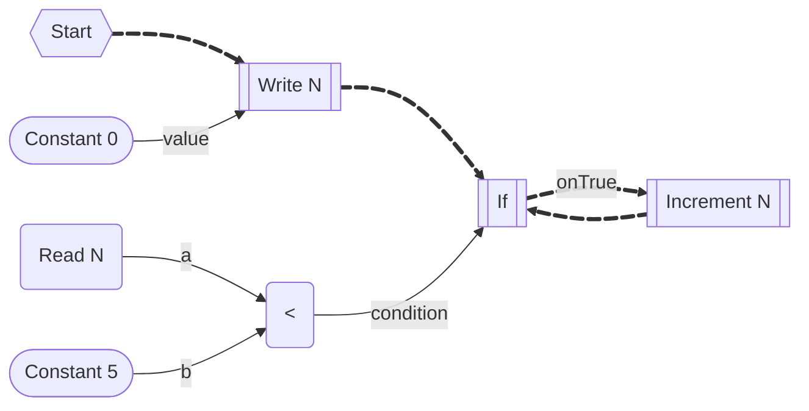

# High Level Intermediate Representation

The high level intermediate representation is used as an intermediate step between reading the IL of node implementations and writing the compiled/transpiled resulting IL.

The HIR of an impulse flow is a [finite-state machine]:

- $\Sigma$ is the input alphabet, which consists of all tail calls;
- $\sigma\in\Sigma$ is a tail call;
- $S$ is the finite non-empty set of states;
- $s_0 \in S$ is the initial state;
- $\delta:S\times\Sigma\to S$ is the state-transition function;
- $\tau\subset S\times\Sigma$ is the set of all yielding/async transitions;

$$
\begin{align}
S_n \overset\sigma\to S_k &\iff \delta(S_n, \sigma) = S_k
\\
S_n \overset\sigma\leadsto S_k &\iff S_n \overset\sigma\to S_k~\land~(S_n,\sigma) \in \tau
\\
S_n \overset\sigma\rightarrowtail S_k &\iff S_n \overset\sigma\to S_k~\land~(S_n,\sigma) \notin \tau
\end{align}
$$

To put it in words: $A\rightarrowtail B$ is a synchronous transition while $A\leadsto B$ is a yielding transition. Calls which are not tail calls do not call as transitions.

[finite-state machine]: https://en.wikipedia.org/wiki/Finite-state_machine

## Basic Example

### Intermediate Representation

## Recursion

### Intermediate Representation

## Non-Tail Calls

### Intermediate Representation

